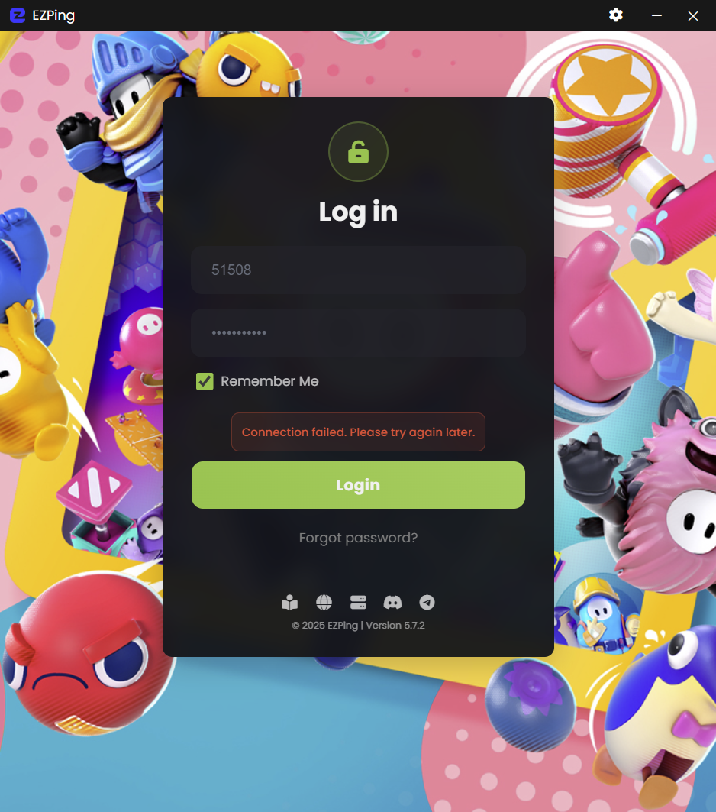

# خطای Connection Failed

اگر در زمان وارد شدن به اکانت خود و یا در زمان کانکت شدن با خطای زیر مواجه شدید، دلیل آن مشکل در برقراری اتصال با سرور اصلی ایزی پینگ می باشد. 

**جهت رفع مشکل موارد زیر را بررسی کنید :**

- از وصل بودن اینترنت سیستم خود مطمعن شوید.
- از غیر فعال بودن برنامه های مشابه و همچنین از غیر فعال بودن **Proxy** سیستم خود مطمعن شوید.
- از سرور اصلی ایزی پینگ، پینگ بگیرید ( در **Run** یا **CMD** کامند **ping ir.ezping.ir** را وارد کنید )
- اگر اینترنت شما وصل بود و پینگ سرور اصلی ایزی پینگ را داشتید، از منوی بالا سمت راست برنامه روی آیکن چرخ دنده کلیک کنید و وارد تنظیمات برنامه شوید. در بخش **Connection Protocol** گزینه **TCP** را انتخاب کنید و دوباره امتحان کنید.
- اگر موارد بالا مشکل را حل نکرد یک بار برنامه را حذف کرده و ورژن آخر برنامه را دانلود کرده و نصب کنید. (آموزش حذف برنامه را از [این بخش](https://docs.ezping.ir/uninstallationguide) می توانید مشاهده کنید.)
- در صورتی که موارد بالا مشکل شما را حل نکرد با پشتیبانی تماس بگیرید.
