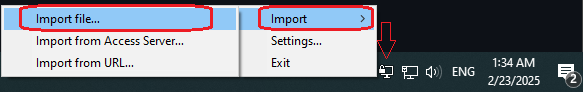
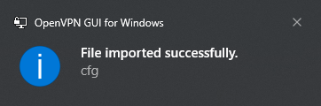
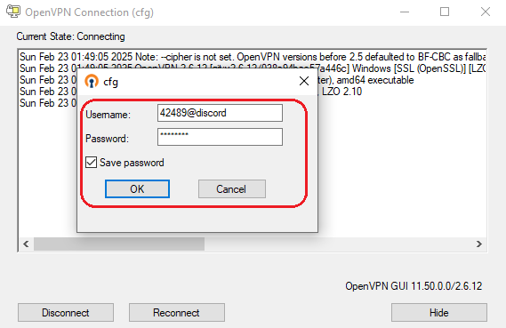
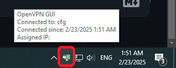

# اتصال با OpenVPN

در راستای حفظ امنیت آنلاین کاربران، تیم **[EZPing](https://ezping.ir/)** شرایطی را فراهم کرده تا افرادی که مایل به نصب و استفاده از اپلیکیشن اختصاصی **EZPing** نیستند نیز بتوانند از خدمات ما بهره ببرند.

اگر شما به دلایل امنیتی مایل به نصب نرم افزار **EZPing** نیستید، میتوانید با دانلود و نصب برنامه **[OpenVPN](https://openvpn.net/)** یا **[OpenVPN Connect](https://openvpn.net/client/client-connect-vpn-for-windows/)** از منابع رسمی، به سرور های متصل شوید و از خدمات ما استفاده کنید. 
این نرم افزار ها به صورت متن-باز بوده و زیر ساخت اصلی سرور های ما از این پلتفرم استفاده میکنند، به همین خاطر امکان برقراری ارتباط با سرور های ما از طریق آن امکان پذیر است.
**توجه داشته باشید که نرم افزار ایزی پینگ هیچ تاثیری بر روی فیلترینگ اعمال شده از داخل کشور نداشته و برای عبور از فیلترینگ نیست.**

# آموزش نحوه اتصال به EZPing با OpenVPN: 

بدین منظور پس از دانلود و نصب برنامه از لینک های رسمی، **[فایل کانفیگ EZPing](http://ir.ezping.ir/downloads/cfg.ovpn)**، که یک فایل کانفیگ **OpenVPN** با پسوند **ovpn.** است، را دانلود کنید و آن را در برنامه **OpenVPN** ایمپورت ( **import** ) کنید. 

برای ایمپورت کردن فایل کانفیگ در برنامه **OpenVPN GUI** ابتدا برنامه را اجرا کرده ( برنامه به صورت یک پروسه بکگراند در کنار ساعت سیستم نمایان میشود ) و سپس روی آیکن برنامه کنار ساعت کلیک راست کرده و گزینه ی "**import**" و سپس "**import file**" را بزنید و فایل کانفیگی که دانلود کردید را انتخاب کنید.

پس از ایمپورت کردن فایل کانفیگ، روی آیکن برنامه کلیک راست کرده و گزینه ی **Connect** را بزنید. سپس در پنجره باز شده اطلاعات خود را وارد کنید.

در فیلد **Username**: نام کاربری اکانت خود را وارد کنید و بعد از آن علامت **@** را قرار داده و سپس نام سرویسی که میخواهید به آن متصل شوید را بنویسید.

در فیلد **Password**: رمز عبور اکانت خود را وارد کنید.

و برای به خاطر سپردن اطلاعات وارد شده تیک گزینه ی " **Save Password** " را فعال کنید.

در مثال زیر فرض بر این است که نام کاربری شما **42489** بوده و میخواهید به سرویس **Discord** متصل شوید.

پس از وارد کردن اطلاعات گزینه ی **OK** را بزنید و منتظر باشید تا اتصال برقرار شود. بعد از برقراری اتصال، صفحه برنامه به طور اتوماتیک بسته میشود. آیکن پایین سمت راست برنامه در کنار ساعت سیستم به رنگ سبز تغییر میکند و این نمایانگر متصل بودن سرویس میباشد.

**اتصال به بیش از یک سرویس ( تا سقف سه سرویس همزمان ) در صورتی که اکانت شما از نوع پلن VIP یا Pro باشد، امکان پذیر است. بدین منظور شما میبایست برای اتصال به هر سرویس، با استفاده از OpenVPN یک TAP آداپتر بسازید.**

**دقت کنید که این روش اتصال نمیتواند برای حالت Pro استفاده شود چرا که حالت پرو مختص EZPing بوده و نیازمند اجرای برنامه اختصاصی EZPing است.**
