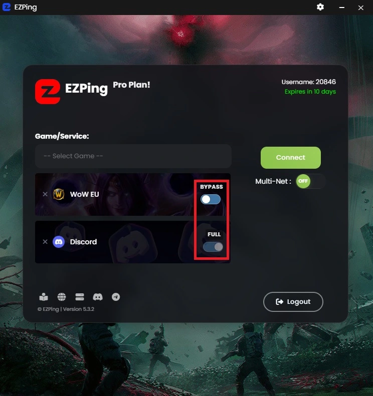

# تفاوت Bypass و Full

در سرویس رفع تحریم **[EZPing](https://ezping.ir/)**، سرویس ها و بازی ها بسته به نوع تحریم اعمال شده، دارای دو حالت اتصال **Bypass** و **Full** هستند. شما می توانید پس از انتخاب بازی یا سرویس مورد نظر، حالت رفع تحریم آن را انتخاب کنید.

## حالت Bypass 

در این حالت، سعی بر این بوده که عمل رفع تحریم با ایجاد کمترین تغییر مسیر صورت گیرد، پس صرفآ مسیر سرور هایی که تحریم از سوی آن ها اعمال شده تغییر می کند و در مسیر اتصال شما با سرور های خود بازی تغییری ایجاد نمی شود، به همین دلیل این حالت اتصال "**دور زدن یا Bypass**" نام گذاری شده است.

برای مثال اگر شما بازی **World of Warcraft** را انتخاب کنید و سوییچ اول و اصلی را روی **Bypass** قرار داده و متصل شوید، ارتباط درون بازی شما با اینترنت خودتان بوده و از سرور های ما عبور نمیکند. این کار باعث میشود تا ارتباط شما با سرور های بازی به صورت مستقیم بوده و بتوانید با بهترین و پایین ترین پینگ قابل ارایه توسط اینترنت خود به بازی بپردازید.

با استفاده از این روش رفع تحریم **Bypass**، ممکن است پینگ شما درون بازی پایین نیاید، اما بالاتر از پینگ خارج خودتان نخواهد بود.

این حالت بیشتر برای اینترنت هایی کاربرد دارد که به نسبت پینگ داخل، پینگ خارج خوبی دارند، پس اتصال مستقیم به سرور های بازی برایشان بهتر است. معمولا سرویس های اینترنت بی سیم مانند همراه اول، ایرانسل و مبین نت و به طور کلی اینترنت های سیم کارتی و یا پوینت تو پوینت اینچنین هستند. این اینترنت ها معمولآ پینگ داخل حدود 40 تا 70 میلی ثانیه دارند در حالی که پینگ اروپا آنها در شرایط مناسب حدود 100 تا 130 است.

علاوه بر این، در زمان هایی که سرور های ما دچار اختلال شده و یا از پینگ و شرایط مناسبی برخوردار نیستند، این اختلالات تاثیری روی بازی شما نمی گذارد زیرا کیفیت اتصال و پینگ بالای سرور داخلی ما برای حالت **Bypass** مهم نیست و صرفا برقرار بودن اتصال کافیست.

## حالت Full

زمانی که سوییچ اول و اصلی را روی  حالت **Full** قرار می دهید بر خلاف حالت **Bypass**، تمامی مسیر های بازی مورد نظر، همچنین مسیر تمامی سرور ها و پلتفرم های مرتبط و مورد نیاز آن از طریق نرم افزار **EZPing** عبور کرده و رفع تحریم میشود. 

در این حالت علاوه بر سرور هایی که از سوی آن ها تحریم اعمال شده، باقی سرور های درون بازی نیز از مسیر ما عبور میکند و این کار می تواند در ثابت تر شدن اتصال، و در مواردی نیز کاهش پینگ تایم را به همراه داشته باشد. 

بعضی از پلتفرم ها یا بازی ها صرفا سرور های ورود به اکانت را محدود کرده اند که این سرویس ها با حالت **Bypass** به راحتی قابل دسترسی هستند، اما بازی هایی که خود سرور داخل بازی آن ها نیز شامل محدودیت ها و تحریم هستند، با حالت **Bypass** قابل دسترسی نیستند و باید حالت **Full** را انتخاب کنید.

همچنین در مواردی اگر نیاز باشد که در روند اتصال شما با بازی هیچ ردّی از آی پی ایران وجود نداشته باشد، میبایست حالت **Full** را انتخاب کنید.

استفاده از حالت **Full** علاوه بر موارد بالا، به شما امکان استفاده از حالت **Multi-Net** را نیز می دهد. حالت **Multi-Net** برای کاربرانی که طرح اشتراک اکانت آنها **Pro** باشد قابل استفاده است. اتصال **Multi-Net** مناسب کاربران حرفه ای و بازی هایی با حساسیت بسیار بالاست، بازی هایی که در آن حتی یک لگ کوچک و یا دیسکانکت لحظه ای میتواند سرنوشت متفاوتی را رقم بزند.
برای کسب اطلاعات بیشتر راجع به سرویس **Multi-Net** [**اینجا**](https://docs.ezping.ir/how-it-works/multi-net-mode) را مطالعه کنید.

_*طبیعی است که با اینترنت های سیم کارتی و وایرلس که پینگ داخلی بالایی دارند ، استفاده از حالت فول پینگ شما را کمی افزایش دهد. پیشنهاد میشود در صورتی که از این اینترنت های غیر ثابت و وایرلس استفاده میکنید و اگر بازی مورد نظر شما حالت **Bypass** را پشتیبانی کرده و قابل اجراست، برای تجربه ی پینگ بهتر حالت **Bypass** را انتخاب کنید. در غیر این صورت از گزینه ی **Full** استفاده کنید.*_
