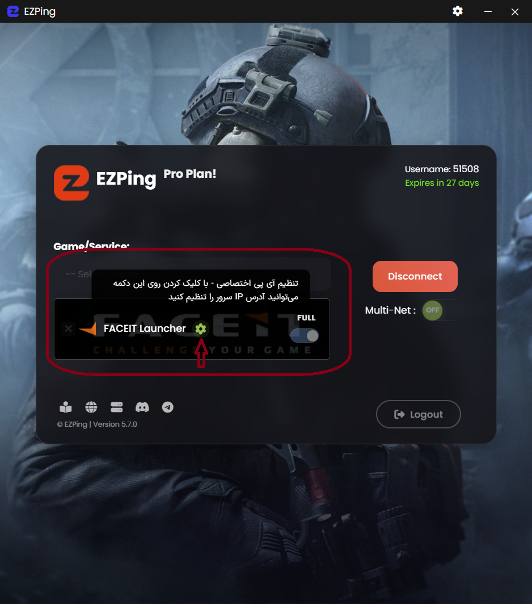
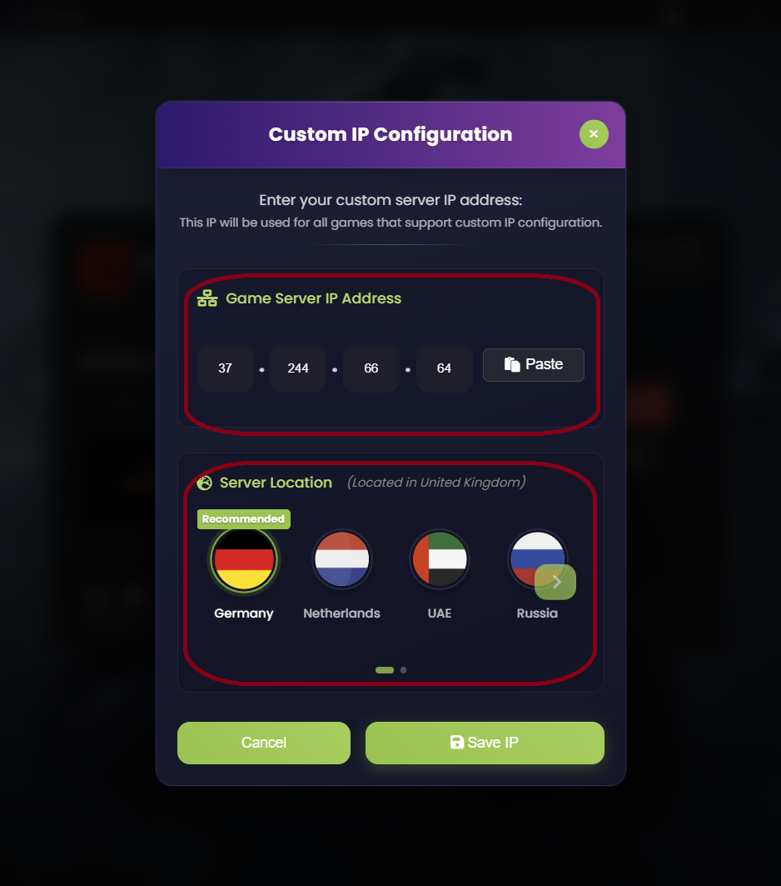
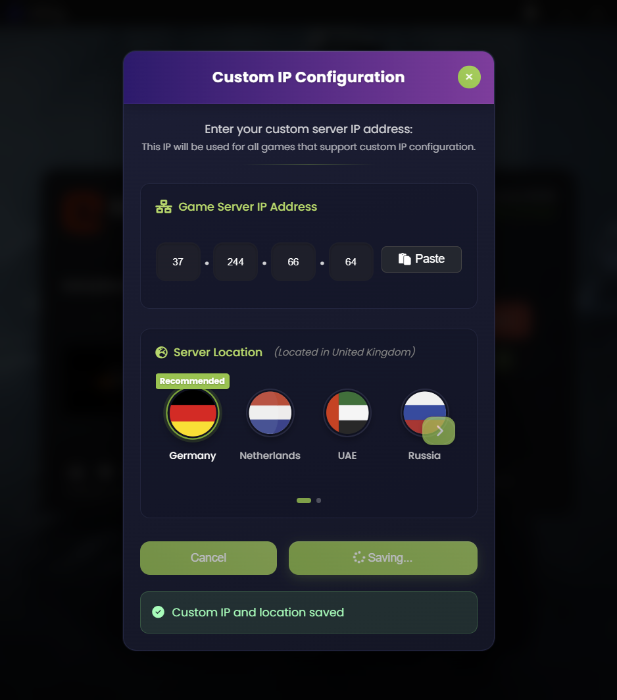

# قابلیت اضافه کردن Custom IP

همانطور که می دانید در بعضی پلتفرم ها و بازی ها مانند **FiveM ، RedM** و یا پلتفرم **FaceIT** و بازی های تحت پوشش آن از جمله **CS2** و **Dota2** ، پس از انتخاب و پیدا کردن سرور ، این پلتفرم ها به شما یک **آدرس IP** میدهند که برای اتصال به بازی باید به صورت مستقیم از طریق کنسول آن بازی ، به این سرور ها متصل شوید. 

در اکثر موارد ، این سرور ها شامل تحریم و محدودیت برای کاربران ایرانی بوده و نمی توان به صورت مستقیم به این سرور ها وصل شد. 

تیم **ایزی پینگ** برای این مشکل راه حل جدید و منحصر به فرد **Add Custom IP** را ارائه داده که با استفاده از آن شما میتوانید آی پی داده شده توسط این پلتفرم ها را در برنامه ایزی پینگ وارد کنید تا مسیر اتصال شما به این سرور از طریق سرورهای ایزی پینگ عبور کند و باعث رفع تحریم و بهبود کیفیت اتصال شود.

# راهنمای Custom IP

برای استفاده از قابلیت **Custom IP** ابتدا باید به حداقل یکی از سرویس های نام برده شده متصل شوید و سپس از طریق دکمه چرخ دنده سبز رنگ، صفحه ی تنظیمات **Custom IP** را باز کنید. 

سپس در صفحه تنظیمات **Custom IP** در کادر **Game Server IP Address** آدرس آی پی سرور مورد نظر را وارد کنید (میتوانید از کپی ، پیست استفاده کنید).
**دقت کنید که در این کادر فقط میتوانید یک ادرس آی پی وارد کنید و استفاده از رنج آی پی مورد قبول نیست.**

بلافاصله پس از وارد کردن آدرس آی پی به صورت صحیح ، در کادر Server Location موقعیت مکانی سرور وارد شده تشخیص داده میشود و به صورت اتوماتیک نزدیک ترین سرور ما برای اتصال به سرور گیم مورد نظر نیز انتخاب می شود.

همچنین شما میتوانید در صورت نیاز سرور دیگری را برای اتصال به سرور گیم مورد نظر انتخاب کنید.

برای مثال در تصویر بالا ، سرور گیم وارد شده در United Kingdom می باشد و برنامه به صورت اتوماتیک سرور آلمان ما را انتخاب کرده. در صورت نیاز میتوانید سرور دیگری را انتخاب کنید. 

پس از وارد کردن آی پی سرور گیم مورد نظر و همچنین انتخاب سرور ما ، بر روی گزینه **Save IP** کلیک کرده و منتظر اعمال تغییرات باشید. پس از گذشت چند لحظه ، پیام Custom IP and Location Saved نمایش داده می شود که نشانگر موفقیت آمیز بودن اعمال تغییرات می باشد .

****لازم به ذکر است که این قابلیت مختص اکانت های **Pro** می باشد و در آن واحد می توان یک آدرس آی پی را اضافه کرد، در صورتی که میخواهید آدرس جدیدی وارد کنید ، مراحل را دوباره انجام دهید تا آی پی جدید با آی پی قبلی جایگرین شود.**
