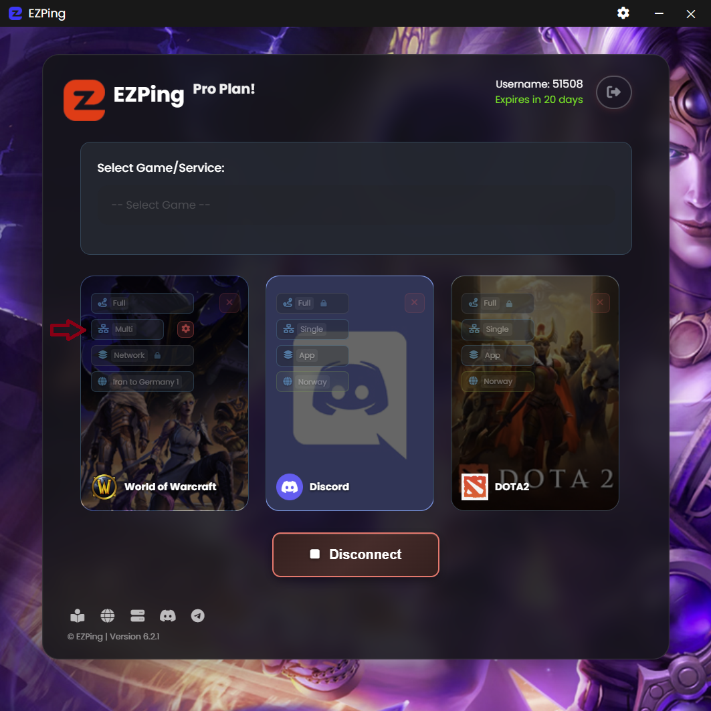
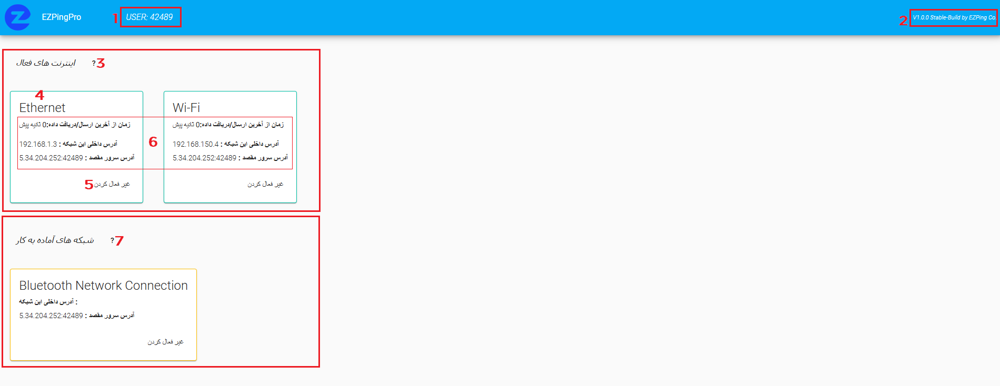
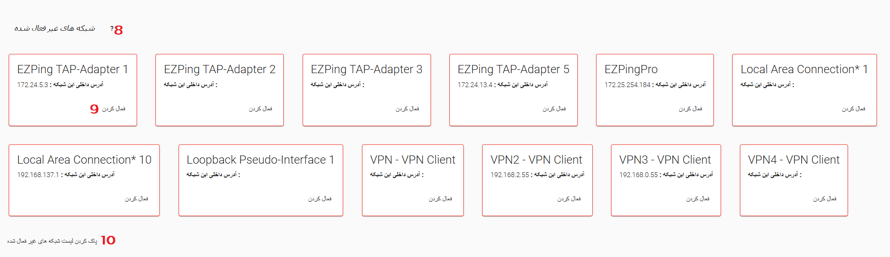

# حالت Multi-net

تیم [**EZPing**](https://ezping.ir/) به منظور آسوده خاطر کردن گیمر های ایرانی عزیز که با مشکلات فراوان اینترنت و ضعیف بودن بستر های داخلی و تحریم های خارجی دست و پنجه نرم می کنند، تصمیم به ساخت این فناوری انحصاری و اختصاصی گرفته تا گیمر های ما بتوانند با اطمینان هرچه تمام تر و به بهترین شکل ممکن به سرور های بازی متصل بشوند. 

نحوه ی عملکرد حالت **Multi-Net** به گونه ای است که کاربر می تواند با بهره گیری همزمان از دو یا چند اینترنت به سرور های مورد نظر متصل شده و در هنگام بازی با بهترین پینگ، اتصالی بدون قطعی و **Packet loss** را تجربه کند. 

در تصویر بالا بازی **World of Warcraft** با حالت **Multi-Net** متصل است.

زمانی که با حالت **Multi-Net** متصل هستید، نرم افزار به طور خودکار تمامی اینترنت هایی که به سیستم متصل کردید از جمله WiFi، دانگل، کابل شبکه، بلوتوث، نقطه اتصال گوشی و یا اتصال گوشی با کابل به سیستم را شناسایی کرده و به لیست اینترنت های فعال اضافه میکند. ترافیک تفکیک شده بازی شما از طریق تمامی اینترنت ها به صورت همزمان عبور کرده و به سمت سرور های ما ارسال می شود. همچنین دقت کنید دکمه **Settings** ظاهر شده مختص تنظیمات حالت Multi-Net است و می توانید مشخص کنید که از کدام آداپتر ها و اینترنت های متصل به سیستم استفاده شود.

این کار باعث میشود تا شما در هنگام بازی در هر لحظه از بهترین پینگ قابل ارائه توسط اینترنت های تان بهره ببرید. در صورتی که یک یا چند اینترنت شما دچار اختلال یا قطعی یا **Timeout** و **Packet loss** شود، تا زمانی که حداقل یکی از مسیر های اینترنتی شما بر قرار باشد شما درون بازی کوچک ترین **Lag** یا **Delay** و **Packet loss** احساس نخواهید کرد. درواقع میتوان گفت که اتصال به حالت **Multi-Net** در آن واحد نواقص اینترنت ها را پر کرده به کاربر بهترین حالت ممکن را ارائه می دهد. 

در مثال بالا، در صورتی که یکی از اینترنت های متصل به سیستم دچار قطعی شود، شما از بازی **World of Warcraft** دیسکانکت نمی شوید اما ممکن است ( بسته به **Metric** اینترنت قطع شده ) از **Discord** و بازی **Dota2** که در این لیست انتخاب کرده اید دیسکانکت شوید، زیرا تنظیمات انتخاب شده برای این دو مورد روی حالت **Single** می باشد.

برای استفاده از حالت **Multi-Net**، کافیست تنظیمات بازی مورد نظر را در برنامه روی حالت **Full** و **Multi-Net** قرار دهید و سپس سرور مورد نظر برای این بازی را نیز تایین کنید. ( لازم به ذکر است که حالت **Multi-Net** فقط برای اکانت های **Pro** قابل انتخاب است )

## وب کنسول تنظیمات Multi-Net

شما می توانید پس از اتصال به حالت **Multi-Net** با باز کردن مرورگر دستگاه خود و وارد کردن آدرس [**127.0.0.1:8585**](http://127.0.0.1:8585/) وارد صفحه تنظیمات حالت **Multi-Net** شوید. آیکن چرخ دنده **⚙** مقابل سوییچ **Multi-Net** نیز همین کار را انجام می دهد.

در این صفحه میتوانید اطلاعات اینترنت های ورودی و فعال خود را مشاهده سپس تصمیم بگیرید کدام را فعال یا غیر فعال کنید. برای مثال اگر 3 منبع اینترنت به دستگاه شما متصل است و فقط میخواهید که ارتباط **EZPing** از 2 تای آن ها استفاده کند، می توانید اینترنت مورد نظر را غیر فعال کنید.

1. نام کاربری
2. اطلاعات مربوط به ورژن و build وب کنسول حالت پرو
3. لیست اینترنت های فعال : شبکه هایی که در این لیست قرار گرفته اند فعال بوده و در حال انتقال داده هستند
4. نام شبکه
5. دکمه غیر فعال کردن این شبکه
6. اطلاعات آی پی داخلی شبکه، آی پی سرور مقصد و مدت زمان از آخرین بسته ی دریافتی/ارسالی از طریق این شبکه
7. شبکه های آماده به کار : شبکه هایی که در این لیست قرار گرفته اند Stand-by هستند و به محض وصل شدن به اینترنت، به لیست سرور های فعال اضافه میشوند
8. شبکه های غیر فعال شده : شبکه هایی که در این لیست قرار گرفته اند غیر فعال بوده و داده انتقال نمیدهند
9. دکمه فعال کردن شبکه ی غیر فعال شده
10. دکمه ی پاک کردن لیست تمامی شبکه های غیر فعال شده (این دکمه را استفاده نکنید، مگر اینکه پشتیبانی به منظوری خاص از شما بخواهد)

_از فعال کردن شبکه های**EZPingPro** ، **EZPing Tap-Adapters** و همچنین **Loopback Adapter** اکیدا خودداری کنید زیرا باعث مختل شدن سرویس می شود. فقط شبکه هایی که نامش برایتان آشناست و سورس اصلی اینترنت ورودی به سیستم شما هستند را فعال / غیر فعال کنید._

**این تکنولوژی، مختص [EZPing](https://ezping.ir/) بوده و نمونه مشابهی ندارد.**
