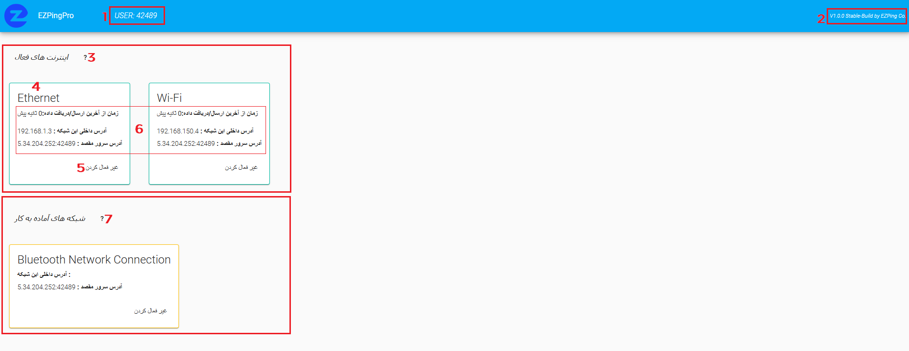

# حالت Pro

تیم [EZPing](https://ezping.ir/) به منظور آسوده خاطر کردن گیمر های ایرانی عزیز که با مشکلات فراوان اینترنت و محدودیت های داخلی و تحریم های خارجی دست و پنجه نرم میکنند ، تصمیم به ساخت این فناوری انحصاری و اختصاصی گرفته تا گیمر های ما بتوانند با اطمینان هرچه تمام تر و به بهترین شکل ممکن به سرور های بازی متصل بشوند. 

نحوه ی عملکرد حالت پرو به گونه ای است که کاربر میتواند با بهره گیری همزمان از دو یا چندین اینترنت به سرور های بازی متصل شده و در هنگام بازی بهترین پینگ، و کانکشنی بدون قطعی و Packet loss را تجربه کند . 

زمانی که با حالت Pro متصل هستید، نرم افزار به طور اتوماتیک تمامی اینترنت هایی که به سیستم متصل کردید اعم از WiFi ، دانگل ، کابل شبکه ، بلوتوث ، نقطه اتصال گوشی ، و یا اتصال گوشی با کابل به سیستم را شناسایی کرده و به لیست اینترنت های فعال اضافه میکند. ترافیک تفکیک شده ی بازی شما از طریق تمامی اینترنت ها به صورت همزمان عبور کرده و به سمت سرور های ما میرود. 

این امر باعث میشود تا شما در هنگام بازی در هر لحظه از بهترین پینگ قابل اراعه  توسط اینترنت های تان بهره ببرید. در صورتی که یک یا چندین اینترنت شما دچار اختلال یا قطعی یا Timeout و Packet loss شود، تا زمانی که حداقل یکی از مسیر های اینترنتی شما بر قرار باشد ، شما درون بازی کوچک ترین Lag و Delay و Packet loss احساس نخواهید کرد. درواقع میتوان گفت که اتصال به حالت Pro در آن واحد نواقص اینترنت ها را پر کرده به کاربر بهترین حالت ممکن را اراعه میدهد. 

برای استفاده از حالت Pro ، کافیست سوییچ Pro رو روشن کنید و دکمه ی کانکت را بزنید. ( برای مشاهده ی دکمه ی Pro ، اکانت شما باید پلن Pro باشد )

**این تکنولوژی فناوری اختصاصی [EZPing](https://ezping.ir/) بوده و تا به اکنون نمونه مشابهی ندارد.**

# وب کنسول تنظیمات Pro

شما میتوانید پس از متصل شدن به حالت Pro با باز کردن مرورگر سیستم خود و وارد کردن آدرس 127.0.0.1:8585 وارد صفحه تنظیمات حالت Pro شوید. 

در این صفحه میتوانید اطلاعات اینترنت های ورودی و فعال خود را مشاهده و آن ها را فعال یا غیر فعال کنید. برای مثال اگه 3 منبع اینترنت به سیستم شما متصل است و فقط میخواهید که ارتباط EZPing از 2 تای آنها استفاده کند ، میتوانید اینترنت مورد نظر را غیر فعال کنید. 

**عکس راهنمای وب کنسول EZPing Pro**

1. نام کاربری
2. اطلاعات مربوط به ورژن و build برنامه
3. لیست اینترنت های فعال : شبکه هایی که در این لیست قرار گرفته اند فعال بوده و در حال انتقال داده هستند
4. نام شبکه
5. دکمه غیر فعال کردن این شبکه
6. اطلاعات آی پی داخلی شبکه ، آی پی سرور مقصد ، و مدت زمان از آخرین بسته ی دریافتی/ارسالی از طریق این شبکه
7. شبکه های آماده به کار : شبکه هایی که در این لیست قرار گرفته اند Stand-by هستند و به محض وصل شدن به اینترنت، به لیست سرور های فعال اضافه میشوند
8. شبکه های غیر فعال شده : شبکه هایی که در این لیست قرار گرفته اند غیر فعال بوده و داده انتقال نمیدهند
9. دکمه فعال کردن شبکه ی غیر فعال شده ( از فعال کردن شبکه های EZPingPro ، EZPing Tap-Adapters و همچنین Loopback Adapter اکیدا خودداری کنید زیرا باعث مختل شدن سرویس میشود ) 
10. دکمه ی پاک کردن لیست تمامی شبکه های غیر فعال شده (این دکمه را استفاده نکنید، مگر اینکه پشتیبانی به منظوری خاص از شما بخواهد)

