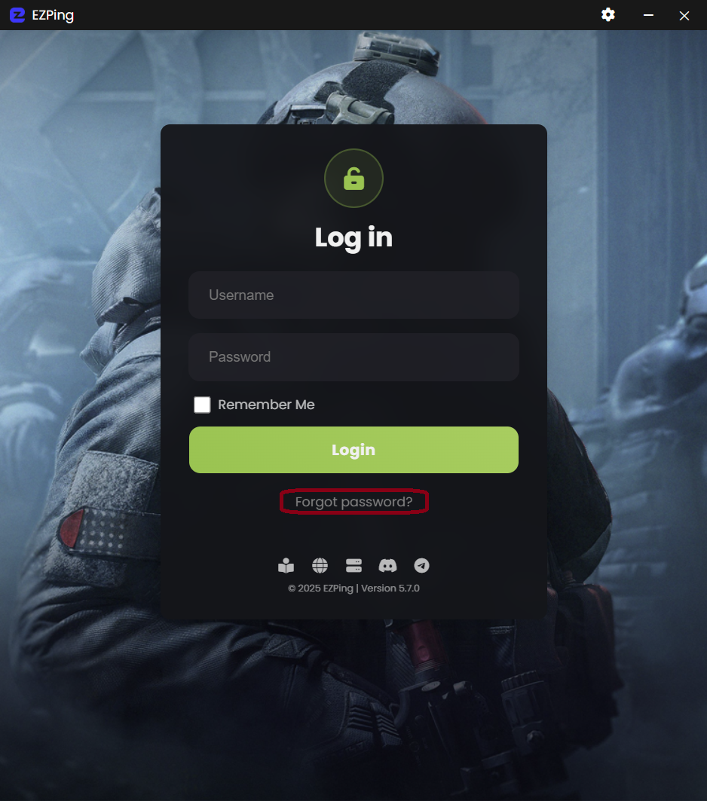

# ریست کردن رمز عبور

در صورتی که رمز عبور اکانت خود را فراموش کرده اید و یا قصد تغییر آن را دارید ، میتوانید از طریق اپلیکیشن ایزی پینگ و بدون نیاز به ورود به سایت این کار را انجام دهید.

در پایین منوی لاگین برنامه بر روی گزینه ی **?Forgot Password** کلیک کنید.

سپس نام کاربری خود را وارد کرده و روی گزینه ی **Submit** کلیک کنید.

در مرحله بعد ، در صورتی که نام کاربری وارد شده درست بوده باشد ، یک پیامک حاوی کد تایید به شماره موبایل مربوط به آن اکانت ارسال خواهد شد.

پس از دریافت کد تایید ، آن را در کادر بالا وارد کنید و سپس در کادر **New Password** رمز عبور جدید خود را وارد کرده و سپس روی گزینه ی **Reset Password** کلیک کنید.

در صورت صحیح بودن کد تایید ، پس از لحظاتی رمز عبور اکانت تغییر خواهد کرد.

