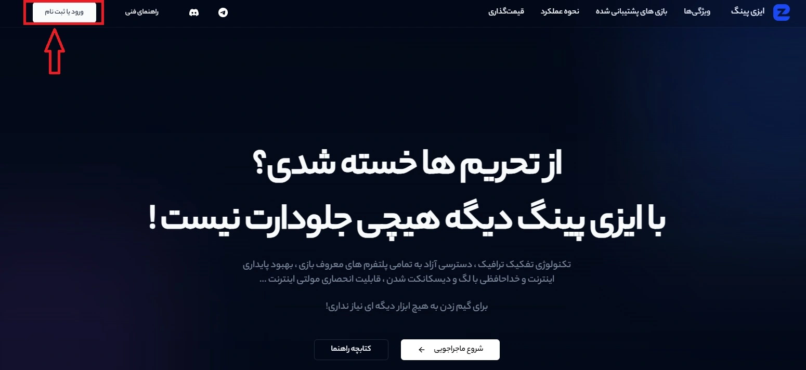
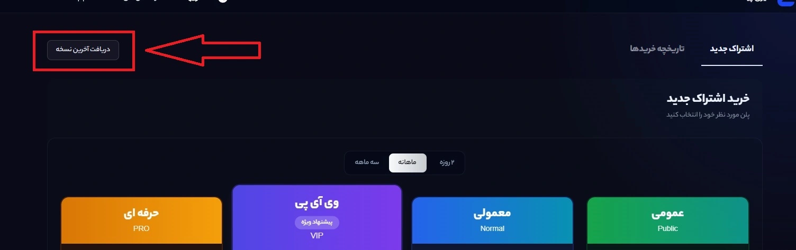

# نصب برنامه

برای دریافت آخرین نسخه نرم افزار وارد **[Landing.ezping.ir](https://landing.ezping.ir/)** شده و سپس با استفاده از شماره موبایل وارد حساب کاربری خود شوید.

پس از ورود به حساب کاربری، مطابق تصویر زیر بر روی دکمه **دریافت آخرین نسخه** کلیک کنید.
دقت کنید این دکمه فقط در صورتی نمایش داده می شود که با استفاده از سیستم عامل ویندوز وارد سایت شده باشید ( به دلیل اینکه نرم افزار ایزی پینگ فقط برای ویندوز توسعه داده شده است )

همچنین می توانید به صورت مستقیم از لینک زیر آخرین نسخه نرم افزار را دریافت کنید.
**[`https://ir.ezping.ir/download/latest`](https://ir.ezping.ir/download/latest)**

پس از دانلود، فایل دریافت شده را اجرا کنید.

نصب ایزی پینگ در ساده ترین حالت ممکن بوده و نرم افزار فقط با یک کلیک به طور کامل و خودکار تمامی اقدامات لازم برای نصب را انجام خواهد داد. به این منظور لطفا مدتی صبر کنید تا تمامی مراحل به صورت خودکار انجام شود. پس از اتمام مراحل نصب، نرم افزار به صورت خودکار اجرا خواهد شد. **فقط ممکن است به خاطر فعال بودن [UAC](https://learn.microsoft.com/en-us/windows/security/application-security/application-control/user-account-control/) نیاز به کلیک بر روی گزینه Yes باشد.**

_دقت کنید که فرایند نصب میتواند بین 1 تا 3 دقیقه زمان بر باشد._

پس از اتمام نصب ، آیکن اجرایی ایزی پینگ بر روی دسکتاپ شما ایجاد می شود و با کلیک بر روی آن می توانید نرم افزار را اجرا کنید.
