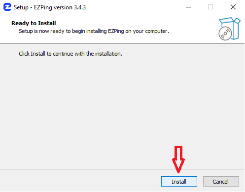

# نصب برنامه

برای دریافت آخرین نسخه نرم افزار وارد **[Landing.ezping.ir](https://landing.ezping.ir/)** شده و سپس با استفاده از شماره موبایل وارد حساب کاربری خود شوید.

پس از ورود به حساب کاربری، مطابق تصویر زیر بر روی دکمه **دریافت آخرین نسخه** کلیک کنید.
دقت کنید این دکمه فقط در صورت نمایش داده می شود که با استفاده از سیستم عامل ویندوز وارد سایت شده باشید ( به دلیل اینکه نرم افزار ایزی پینگ فقط برای ویندوز توسعه داده شده است )

همچنین می توانید به صورت مستقیم از لینک زیر آخرین نسخه نرم افزار را دریافت کنید.
[`https://ir.ezping.ir/download/latest`](https://ir.ezping.ir/download/latest)

پس از دانلود، فایل دریافت شده را اجرا و بر روی گزینه ی Install کلیک کنید.

نصب ایزی پینگ در ساده ترین حالت ممکن بوده و نرم افزار فقط با یک کلیک به طور کامل و خودکار تمامی اقدامات لازم برای اتصال را انجام خواهد داد. به این منظور لطفن تا نمایان شدن گزینه ی Finish منتظر بمانید و سپس روی این گزینه کلیک کنید تا نصب به پایان برسد.

 

_دقت کنید که فرایند نصب میتواند بین 1 تا 3 دقیقه زمان بر باشد. اگر خط روند نصب نرم افزار به آخر رسیده ولی گزینه ی Finish فعال نشده است برنامه در حال نصب و ایجاد Adapter های لازم میباشد ، لطفا منتظر بمانید._

پس از اتمام نصب ، آیکون اجرایی ایزی پینگ بر روی دسکتاپ شما ایجاد می شود و با کلیک بر روی آن می توانید نرم افزار را اجرا کنید.
