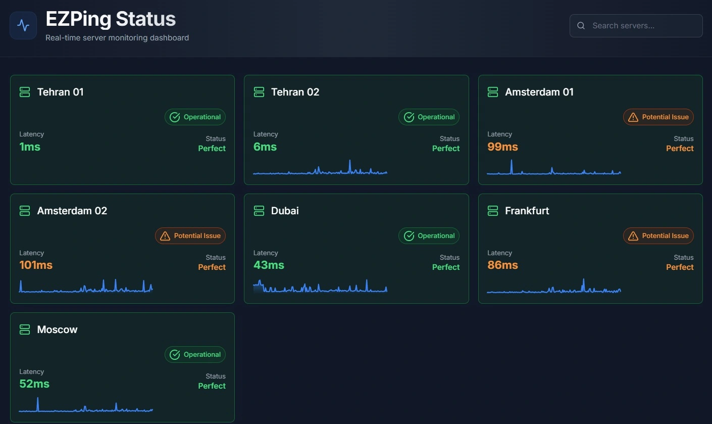
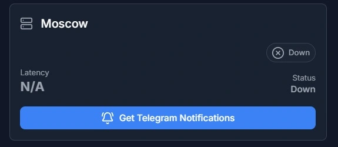

# صفحه وضعیت سرور ها

شما میتوانید با مراجعه به **[صفحه وضعیت سرور ها](https://status.ezping.ir/)**، از برقراری ارتباط هر سرور اطمینان حاصل کنید. همچنین میزان کیفیت هر سرویس به صورت لحظه ای با نمودار **Latency** قابل مشاهده است.

دقت کنید که این نمودار، میزان تاخیر از سرور های داخلی ما تا سرور های خارج را نشان می دهد و به این معنی نیست که در صورت اتصال به یک سرویس، پینگ شما درون بازی برابر با نمودار باشد. برای به دست آوردن پینگ تایم حدودی خود پس از اتصال، باید مقدار پینگی که اینجا مشاهده می کنید را با پینگ تایم اینترنت خود تا سرور داخلی ما جمع کنید. ( برای به دست آورن پینگ داخلی خود از آدرس **ir.ezping.ir** پینگ بگیرید )

برای مثال اگر پینگ تایم اینترنت شما تا سرور ایران ما، به نشانی **ir.ezping.ir** حدود **20ms** باشد، و پینگ تایم سرور **Dubai** حدود **55ms** باشد، پینگ احتمالی و حدودی شما درون بازی های دارای سرور دبی معادل **~75ms** خواهد بود. دقت کنید که این اعداد تقریبی و نسبی بوده و به هیچ وجه دقیق نیستند و فقط به شما کمک میکنند تا یک آمار تقریبی از کیفیت ارتباط بدست آورید.

بدیهی است که این محاسبات فقط مربوط به سرورهای **Full mode** است که تمامی ترافیک آن سرویس را عبور می دهند.( برای اطلاعات بیشتر **[اینجا](https://docs.ezping.ir/how-it-works/bypass-vs-full)** را مطاطعه کنید )

با توجه به نحوه عملکرد سرورهای **Bypass**، پینگ تایم سرور های **Bypass mode** مهم نبوده و تاثیری در بازی شما نمی گذراند و نمایانگر پینگ شما در بازی نیستند، چرا که در این حالت ترافیک درون بازی شما به صورت مستقیم از اینترنت خودتان عبور میکند ( برای اطلاعات بیشتر **[اینجا](https://docs.ezping.ir/how-it-works/bypass-vs-full)** را مطاطعه کنید ).
در رابطه با سرورهای **Bypass mode** صرفا برقرار بودن اتصال کافیست و پینگ تایم این سرور ها از اولویت بالایی برخوردار نیستند.

در صورت وجود اختلال در یک سرور، وضعیت و نمودار آن به صورت **Down** و خاموش خواهد بود. شما میتوانید با استفاده از ربات و گزینه ی **Get Notification** یک پیام مبنی بر آنلاین شدن این سرور در تلگرام دریافت کنید.

