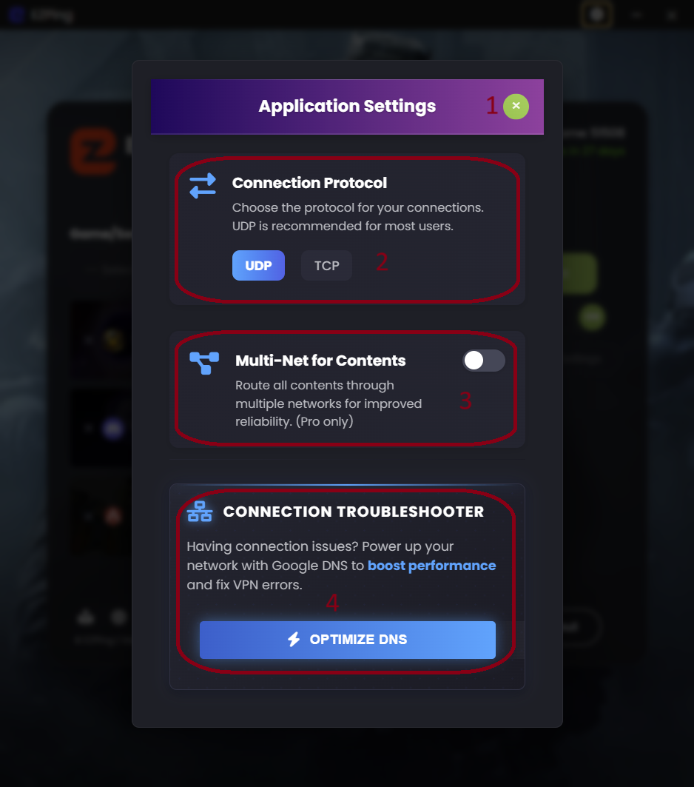

# راهنمای تنظیمات EZPing

با وجود اینکه برای راحتی استفاده از نرم افزار، بیشتر تنظیمات **EZPing** به صورت داینامیک طراحی شده و در هنگام اتصال با توجه به پارامتر های مختلف به صورت خودکار اعمال می شود، گاهی ممکن است که کاربران نیازمند انجام تغییرات دستی برای اتصال باشند. 

در این بخش توضیحاتی در رابطه با گزینه های موجود در صفحه تنظیمات ارائه شده است.

# بخش Connection Protocol

در این بخش شما می توانید پروتکل اتصال مورد استفاده توسط **OpenVPN** را انتخاب کنید. به صورت پیش فرض این گزینه روی حالت **UDP** تنظیم شده. پروتکل **UDP** دارای **Overhead** کمتر و سرعت بیشتری می باشد و برای استفاده های گیم مناسب تر بوده و لتنسی پایین تری ارائه می دهد. 

در مواردی خاص و نادر ، بعضی از ارائه دهنده های اینترنت کشور دچار مشکل شده و پروتکل **UDP** را روی یک سری رنج آی پی ها محدود می کنند که در این صورت می توان با تنظیم کردن این گزینه روی **TCP** ، به سرویس ایزی پینگ متصل شد. 

پیشنهاد می شود تا زمانی که که پروتکل **UDP** برای شما قابل استفاده هست، از تنظیم کردن این گزینه روی **TCP** خودداری کنید. 

# بخش CDN Connection Protocol

این گزینه برای تنظیم پروتکل مورد استفاده برای توضیع محتوا و ترافیک غیر حساس است.

- **حالت CDN Over Wireguard** : با تنظیم این گزینه روی حالت **CDN Over Wireguard** دیتای غیر گیمینگ و محتوای غیر حساس از کانکشن **Wireguard** به صورت مستقیم عبور می کند. این گزینه سرعت بیشتری دارد و برای توضیع محتوا بهتر است. در اکثر موارد این گزینه پیشنهاد می شود.
  
این گزینه از حالت **Multi-Net** پشتیبانی نمی کند. برای مثال اگر کانکشن محتوا روی حالت **CDN Over Wireguard** باشد و شما به سرویس **WoW-Full** و **دیسکورد** با حالت **Multi Internet** فعال، متصل باشید و در حال انجام بازی **World of Warcraft** باشید، در صورتی که اینترنت اول و اصلی سیستم شما دچار مشکل شود، شما در بازی **World of Warcraft** لگ و یا دیسکانکتی نخواهید داشت، ولی در استفاده از بقیه سرویس ها مانند دیسکورد و یا وبسایت هایی که ایزی پینگ باعث رفع تحریم آن ها شده، دچار مشکل خواهید شد تا زمانی که اینترنت اول و اصلی سیستم دوباره متصل شود.

________________________________________________________________________________________________________________________________________________________________

- **حالت CDN Over OpenVPN** : با تنظیم این گزینه روی حالت **CDN Over OpenVPN** دیتای غیر گیمینگ و محتوای غیر حساس نیز از کانکشن **OpenVPN** عبور کند. به طور کلی این حالت سرعت و پهنای باند کمتری دارد و ممکن است کمی کند تر عمل کند و یا در شرایطی که از حد اکثر پهنای باند پشتیبانی شده استفاده کنید، علی رغم اینکه پهنای باند اینترنت شما توانایی هندل کردن این پهنای باند را دارد، ممکن است در بازی دچار نوسان پینگ شوید چرا که پهنای باند کانکشن OpenVPN به حداکثر رسیده.

این گزینه از حالت **Multi-Net پشتیبانی می کند** و برای زمانی مناسب است که شما می خواهید در زمان اتصال به برنامه و در صورت قطعی اینترنت اصلی سیستم، حتی در استفاده از موارد غیر حساس و غیر گیمینگ و توضیع محتوا نیز وقفه ای ایجاد نشود.
در مثال بالا، اگر کانکشن توضیع محتوا روی حالت **CDN Over OpenVPN** باشد و حالت Multi-Net فعال باشد، حتی در زمان قطعی اینترنت اول سیستم نیز مشکلی برای استفاده از تمامی سرویس ها و سایت هایی که ایزی پینگ بر روی آن ها اثر دارد نخواهید داشت.
همچنین در مواردی نادر، بعضی از کاربران اپراتور همراه اول، در اتصال به **Wireguard** مشکل دارند که در این صورت باید گزینه **CDN Over OpenVPN** را فعال کنند.

پس از تغییر دادن حالت کانکشن محتوا، برنامه از شما درخواست ری استارت اپلیکیشن را می کند که با کلیک بر روی **Restart Now** به صورت اتوماتیک انجام می شود و تغییرات اعمال می شود.

**بدیهی است که انتخاب کردن گزینه CDN Over OpenVPN و فعال بودن گزینه Multi-Net، موجب عبور ترافیک غیر حساس و محتوایی از تمامی اینترنت های شما شده و هزینه های اینترنت شما را افزایش می دهد، به همین منظور پیشنهاد می شود تا مگر در مواقع ضروری و حساس، کانکشن محتوا را روی OpenVPN تنظیم نکنید. حالت پیش فرض این گزینه CDN Over Wireguard می باشد.**

# بخش Connection Troubleshooter

این گزینه برای زمانی است که شما در هنگام ورود به اکانت یا در هنگام اتصال به برنامه با خطای **Turn Off VPN** مواجه می شوید، در صورتی که اطمینان دارید که روی سیستم **VPN** یا سرویس رفع تحریم دیگری فعال نیست.

در بعضی موارد، ارائه دهنده های اینترنت کشور، برای اعمال یک سری رفع تحریم ها، از دی ان اس هایی استفاده می کنند که مسیر اتصال شما به بعضی از سرویس های تشخیص دهنده آی پی را از مسیر کشور های دیگری عبور می دهند. همین امر باعث می شود تا در بعضی مواقع، سیستم تشخیص لوکیشن برنامه ایزی پینگ لوکیشن شما را کشور دیگری تشخیص داده و به شما اجازه دسترسی به برنامه را ندهد. 

تیم **ایزی پینگ** برای حل این مشکل، گزینه **Optimize DNS** را فراهم کرده و شما می توانید با یک کلیک، روی سیستم خودتان دی ان اس های **گوگل** و **کلادفلر** را ست کنید.

بعد از کلیک بر روی این گزینه و پس از چند ثانیه، دی ان اس های **گوگل** و **کلادفلر** روی سیستم اعمال می شود و همچنین **Resolver Cache** نیز پاک می شود، و سپس برنامه از شما درخواست ری استارت اپلیکیشن را می کند که با کلیک بر روی **Restart Now** به صورت اتوماتیک انجام می شود و تغییرات اعمال می شود. 
