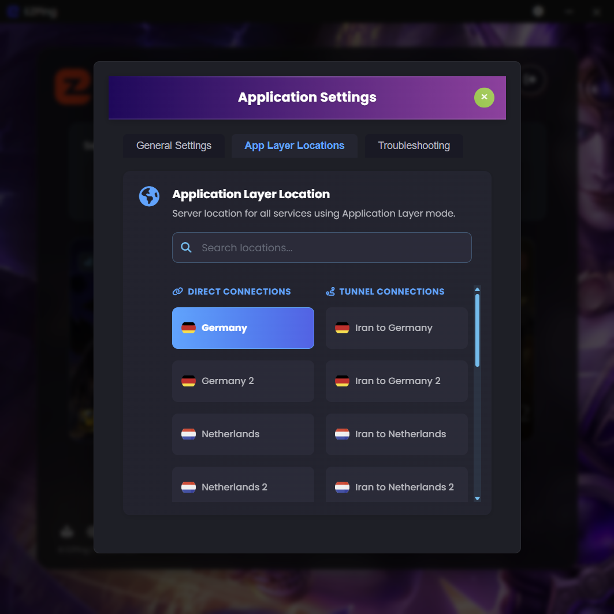

# سربرگ App Layer Locations

در این سربرگ از تنظیمات، شما می توانید لوکیشن و سرور مورد نظر خود برای ارتباط **App Layer** را انتخاب کنید. ( برای اطلاعات بیشتر راجع به حالت **App Layer** اینجا را مطالعه کنید )

در این سربرگ دو ستون کلی برای هر سرور در نظر گرفته شده :

- ستون **Direct Connections** : در صورتی که یکی از سرور های ستون **Direct Connections** را انتخاب کنید، ارتباط **App Layer** شما با لوکیشن و سرور مورد نظر به صورت مستقیم برقرار خواهد شد.
- ستون **Tunnel Connections** : در صورتی که یکی از سرور های ستون **Tunnel Connections** را انتخاب کنید، ارتباط **App Layer** شما با لوکیشن و سرور مورد نظر به صورت غیر مستقیم و به واسطه ی سرور ایران ایزی پینگ برقرار خواهد شد.

_دقت کنید که در آن واحد فقط یک لوکیشن و سرور را می توان انتخاب کرد._
