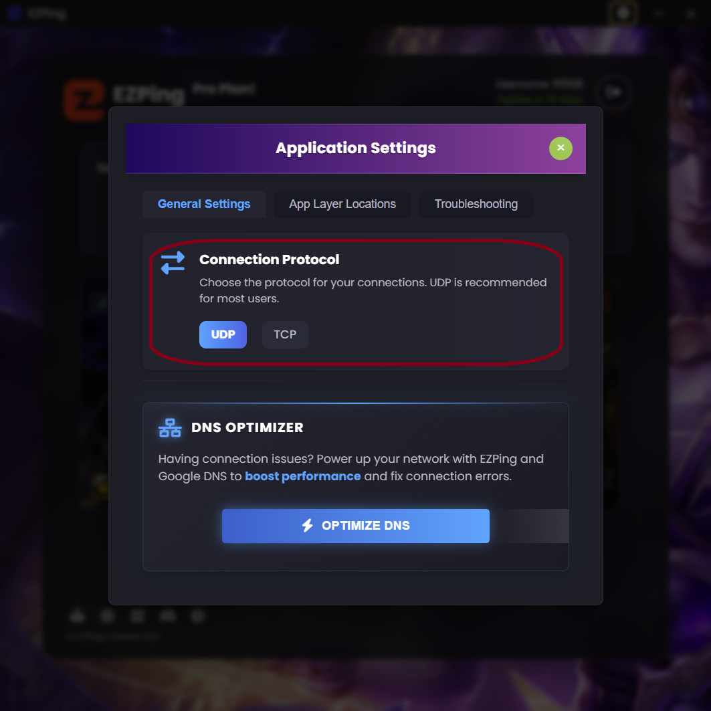

# سربرگ General Settings

با وجود اینکه برای راحتی استفاده از نرم افزار، بیشتر تنظیمات **EZPing** به صورت داینامیک طراحی شده و در هنگام اتصال با توجه به پارامتر های مختلف به صورت خودکار اعمال می شود، گاهی ممکن است که کاربران نیازمند انجام تغییرات دستی برای اتصال باشند.

## بخش Connection Protocol

در این بخش شما می توانید پروتکل اتصال مورد استفاده توسط **OpenVPN** را انتخاب کنید. به صورت پیش فرض این گزینه روی حالت **UDP** تنظیم شده. پروتکل **UDP** دارای Overhead کمتر و سرعت بیشتری می باشد و برای استفاده های گیم مناسب تر بوده و پینگ پایین تری ارائه می دهد.

در مواردی خاص و نادر ، بعضی از ارائه دهنده های اینترنت کشور دچار مشکل شده و پروتکل **UDP** را روی یک سری رنج آی پی ها محدود می کنند که در این صورت می توان با تنظیم کردن این گزینه روی **TCP**، به سرویس ایزی پینگ متصل شد.

پیشنهاد می شود تا زمانی که که پروتکل **UDP** برای شما قابل استفاده است، از تنظیم کردن این گزینه روی **TCP** خودداری کنید.

## بخش DNS Optimizer

این گزینه سرور های دی ان اس **EZPing** و **گوگل** را روی سیستم شما ست کرده و همچنین **Resolver Cache** سیستم شما را پاک می کند و برای اعمال تغییرات انجام شده، از شما درخواست ری استارت اپلیکیشن را می کند که با کلیک بر روی **Restart Now** به صورت اتوماتیک برنامه بسته و مجددا اجرا می شود.

ست کردن **DNS** های **EZPing** و **گوگل** باعث می شود تا سیستم شما درخواست های DNS را از سرور های ایزی پینگ بخواهد و همچنین سرور دی ان اس عمومی گوگل نیز در مواقعی که سرور DNS ایزی پینگ دچار مشکل شده باشد، به عنوان بک آپ عمل می کند.

همچنین در بعضی موارد، ارائه دهنده های اینترنت کشور، برای اعمال یک سری رفع تحریم ها، از دی ان اس هایی استفاده می کنند که مسیر اتصال شما به بعضی از سرویس های تشخیص دهنده آی پی را از مسیر کشور های دیگری عبور می دهند. همین امر باعث می شود تا در بعضی مواقع، سیستم تشخیص لوکیشن برنامه ایزی پینگ، لوکیشن شما را کشور دیگری تشخیص داده و به شما اجازه دسترسی به برنامه را ندهد، که با ست کردن دی ان اس **EZPing** این مشکل حل می شود.
