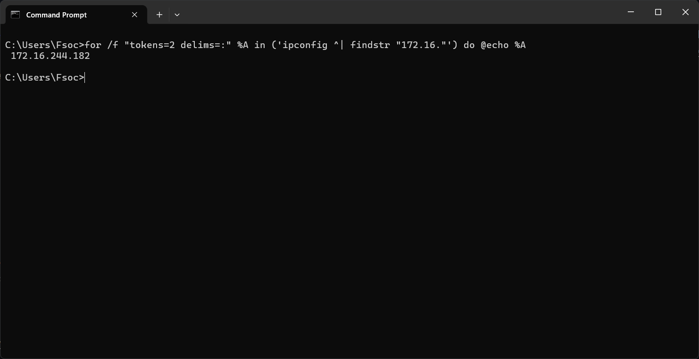

# سرویس LAN

**[ایزی پینگ](https://ezping.ir/ )** با راه اندازی سرویس **LAN**، امکان برقراری ارتباط تحت شبکه میان دو یا چند کاربر، صرف نظر از اینکه در چه لوکیشنی و با چه اینترنتی هستند را فراهم کرده است.

کاربران پس از اتصال به سرویس **LAN**، یک IP داخلی در بازه **172.16.1.0** تا **172.16.255.254** دریافت می کنند و می توانند با بقیه کاربرانی که به این سرویس متصل هستند ارتباط تحت شبکه برقرار کنند.

# از جمله کاربرد های این سرویس میتوان به موارد زیر اشاره کرد:

- **انجام بازی های تحت شبکه با کمترین پینگ**: شما می توانید با دوستان خود، صرف نظر از اینکه در چه شهری هستند به انجام بازی های تحت شبکه با پینگ داخلی بپردازید.
- **امکان استفاده از حالت Multi-Net  برای کانکشن LAN**
- **کنترل از راه دور**: با متصل شدن هر دو طرف به سرویس **LAN**، شما می توانید با استفاده از ابزار هایی مانند **Remote Desktop** و ابزار مشابه به کنترل از راه دور با پایین ترین تاخیر اقدام کنید و از دردسر های نرم افزار هایی مانند **Anydesk** و **TeamViewer** راحت شوید.
- **ایجاد سرور بدون نیاز به داشتن آی پی ثابت**: شما می توانید روی سیستم خود سرور تیم اسپیک، ماینکرفت، WoW و ... را راه اندازی کرده و با اتصال به سرویس **LAN**، دوستان خود را به سرور خود دعوت کنید. فقط کافیست IP اختصاص داده شده به کامپیوتر خود را به دوستانتان بدهید و با بازی با آنها با کمترین پینگ لذت ببرید.


برای مشاهده IP دریافتی از سمت نرم افزار به کامپیوتر خود، پس از اتصال به سرویس **LAN**، یک "**CMD**" باز کرده و دستور زیر را در آن کپی پیست کنید:


```bash
for /f "tokens=2 delims=:" %A in ('ipconfig ^| findstr "172.16."') do @echo %A
```



در مثال فوق، IP دریافتی **172.16.244.182** است.
