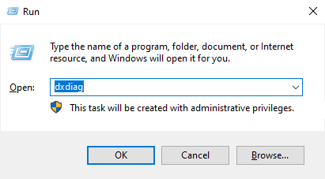

# سیستم مورد نیاز

 سیستم عامل : در حال حاضر نرم افزار روی سیستم عامل **ویندوز 10 و 11** تست شده و قابل اجرا میباشد.

 در ویندوز 10 نسخه بیلد ویندوز شما باید **1809** به بالا باشد ، برای مشاهده کردن این ورژن میتوانید در پنجره Run ( Windows + R ) عبارت **"dxdiag"** را تایپ کنید و این مورد را مشاهده فرمایید.

 حداقل سخت افزار مورد نیاز : 

 برنامه ایزی پینگ بسیار سبک و بهینه بوده و برای اجرا نیاز به سخت افزار خاص و بالایی ندارد و بر روی ساده ترین سیستم ها قابل اجرا میباشد. 
