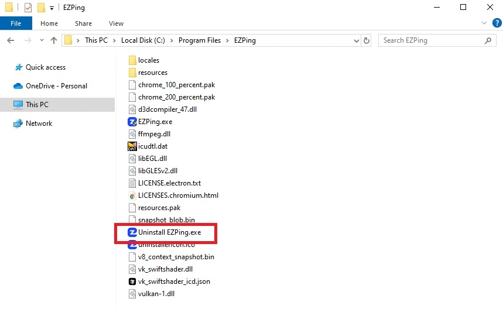
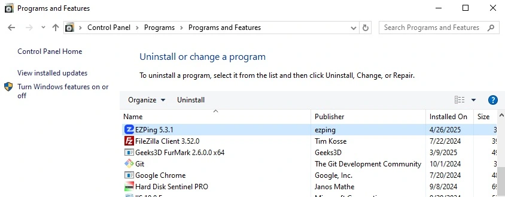

# حذف برنامه


برای پاک کردن نرم افزار میتوانید به دو روش اقدام کنید :

 - پاک کردن برنامه با استفاده از فایل **Uninstall EZPing.exe** موجود در مسیر زیر :
```bash
C:\Program Files\EZPing\Uninstall EZPing.exe
```




 - پاک کردن برنامه با استفاده از **Control Panel** :

   وارد کنترل پنل شده و از راه **Programs and Features** برنامه را به صورت کامل پاک کنید.




**لازم به ذکر است که Uninstall کردن برنامه ایزی پینگ تمامی فایل ها و تنظیمات مربوط به ایزی پینگ و تغییرات ایجاد شده توسط ایزی پینگ در سیستم را حذف می کند.**
