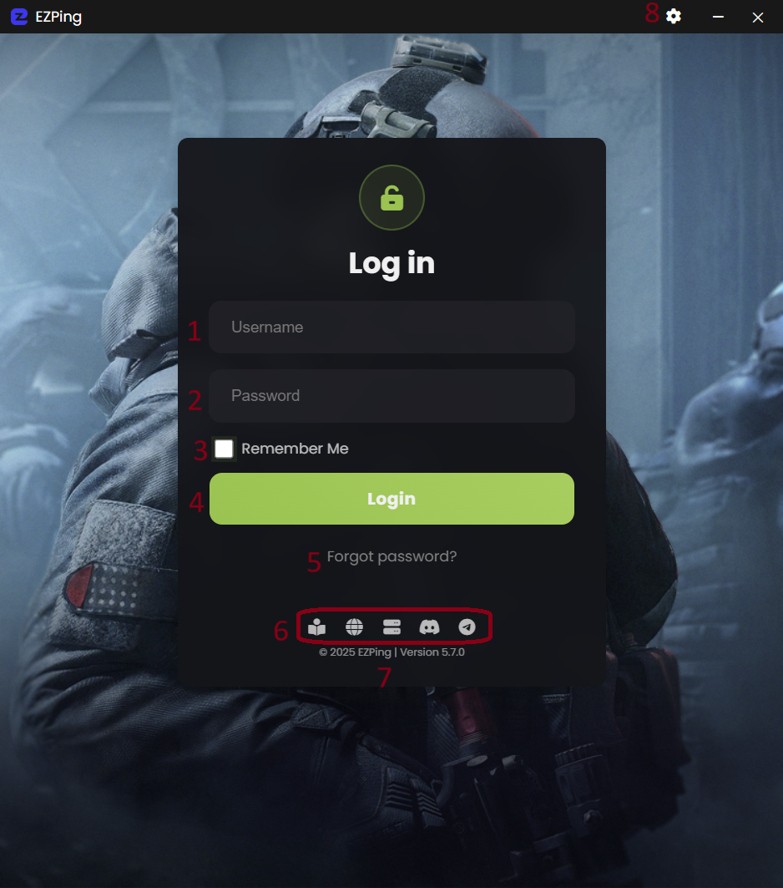

# رابط کاربری صفحه ورود ( Login )

1. فیلد Username
2. فیلد Password
3. ذخیره نام کاربری و پسورد برای ورود خودکار در اجرا های بعدی
4. دکمه ورود به اکانت
5. بازیابی یا تغییر رمز عبور ( برای آموزش [این بخش](https://docs.ezping.ir/how-to-reset-password) را مطالعه کنید )
6. دکمه های دسترسی سریع به [راهنمای فنی](https://docs.ezping.ir/) ، [وبسایت EZPing](https://landing.ezping.ir/)  ، [وضعیت سرور ها](https://status.ezping.ir/) ، [چنل دیسکورد](https://discord.gg/KyTRwptwUs) ، [چنل تلگرام](https://t.me/ezping)
7. نشانگر ورژن برنامه
8. دکمه ورود به تنظیمات برنامه

