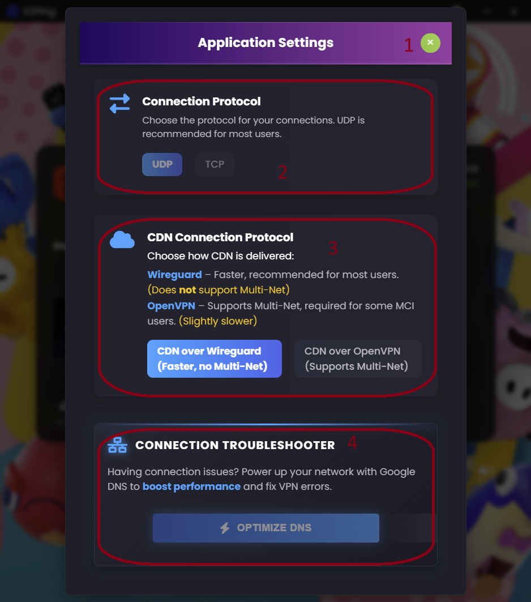

# رابط کاربری صفحه ورود ( Login )

1. فیلد Username
2. فیلد Password
3. ذخیره نام کاربری و پسورد برای ورود خودکار در اجرا های بعدی
4. دکمه ورود به اکانت
5. بازیابی یا تغییر رمز عبور ( برای آموزش [این بخش](https://docs.ezping.ir/how-to-reset-password) را مطالعه کنید )
6. دکمه های دسترسی سریع به [راهنمای فنی](https://docs.ezping.ir/) ، [وبسایت EZPing](https://landing.ezping.ir/)  ، [وضعیت سرور ها](https://status.ezping.ir/) ، [چنل دیسکورد](https://discord.gg/KyTRwptwUs) ، [چنل تلگرام](https://t.me/ezping)
7. نشانگر ورژن برنامه
8. دکمه ورود به تنظیمات برنامه

# رابط کاربری صفحه تنظیمات برنامه (Settings)

1. دکمه خروج از صفحه تنظیمات
2. سوییچ انتخاب پروتکل اتصال (برای اطلاعات بیشتر راجع به این گزینه، [این بخش](https://docs.ezping.ir/settings-guide#:~:text=%D8%A8%D8%AE%D8%B4%20Connection%20Protocol) را مطالعه کنید.)
3. سوییچ تغییر پروتکل مورد استفاده برای کانکشن محتوا (برای اطلاعات بیشتر راجع به این گزینه، [این بخش](https://docs.ezping.ir/settings-guide#:~:text=%D8%A8%D8%AE%D8%B4%20CDN%20Connection%20Protocol) را مطالعه کنید.)
4. دکمه ست کردن DNS گوگل و همچنین پاک کردن Cache دی ان اس سیستم (برای اطلاعات بیشتر راجع به این گزینه، [این بخش](https://docs.ezping.ir/settings-guide#:~:text=%D8%A8%D8%AE%D8%B4%20Connection%20Troubleshooter) را مطالعه کنید.)
