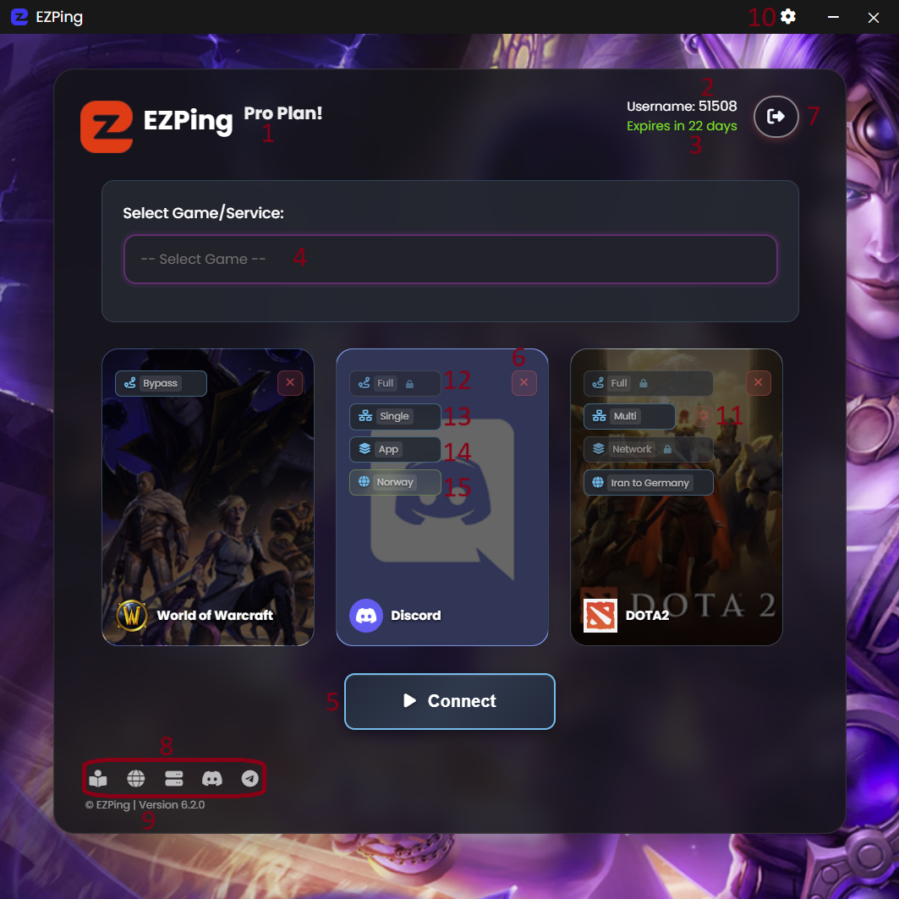

# رابط کاربری صفحه اصلی برنامه ( Main Menu )

راهنمای رابط کاربری صفحه اصلی برنامه

1. نوع بسته فعال روی اکانت ( برای اطلاعات بیشتر راجع به بسته های مختلف [این بخش](https://docs.ezping.ir/category/%D9%BE%D9%84%D9%86-%D9%87%D8%A7%DB%8C-%D8%A7%DA%A9%D8%A7%D9%86%D8%AA) را مطالعه کنید ) 
2. نام کاربری اکانت
3. تعداد روز های باقی مانده اکانت
4. منوی انتخاب بازی یا سرویس
5. دکمه کانکت و دیسکانکت
6. گزینه حذف بازی یا سرویس از لیست انتخابی 
7. دکمه خروج از اکانت ( Logout )
8. دکمه های دسترسی سریع به [راهنمای فنی](https://docs.ezping.ir/) ، [وبسایت EZPing](https://landing.ezping.ir/)  ، [وضعیت سرور ها](https://status.ezping.ir/) ، [چنل دیسکورد](https://discord.gg/KyTRwptwUs) ، [چنل تلگرام](https://t.me/ezping)
9. اطلاعات ورژن و بیلد نرم افزار ایزی پینگ
10. دکمه ورود به تنظیمات برنامه
11. دکمه باز کردن وب کنسول تنظیمات Multi-Internet ( برای اطلاعات بیشتر راجع به وب کنسول تنظیمات [این بخش](https://docs.ezping.ir/how-it-works/multi-net-mode#:~:text=%D9%88%D8%A8%20%DA%A9%D9%86%D8%B3%D9%88%D9%84%20%D8%AA%D9%86%D8%B8%DB%8C%D9%85%D8%A7%D8%AA%20Multi%2DNet) را مطالعه کنید )
12. سوییچ انتخاب بین حالت **Bypass** یا **Full** ( برای اطلاعات بیشتر در این مورد، [اینجا](https://docs.ezping.ir/how-it-works/bypass-vs-full) را مطالعه کنید. )
13. سوییچ انتخاب بین حالت **Single** یا **Multi-net** ( برای اطلاعات بیشتر در این مورد، [اینجا](https://docs.ezping.ir/how-it-works/multi-net-mode) را مطالعه کنید. )
14. سوییچ انتخاب بین حالت اتصال **Network Layer** و **App Layer** ( برای اطلاعات بیشتر در این مورد، اینجا را مطالعه کنید. )
15. سوییچ انتخاب لوکیشن و سرور برای این سرویس
