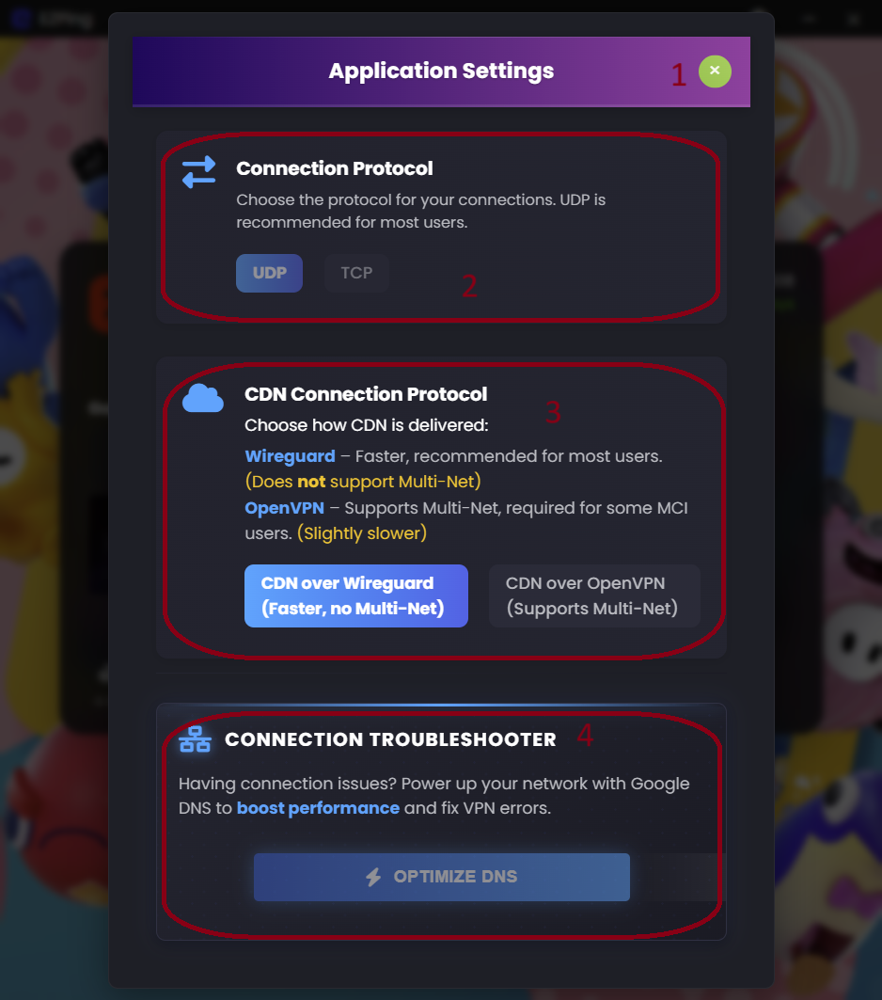

# صفحه تنظیمات برنامه Settings

راهنمای رابط کاربری صفحه تنظیمات برنامه

1. دکمه خروج از صفحه تنظیمات
2. سوییچ انتخاب پروتکل اتصال (برای اطلاعات بیشتر راجع به این گزینه، [این بخش](https://docs.ezping.ir/settings-guide#:~:text=%D8%A8%D8%AE%D8%B4%20Connection%20Protocol) را مطالعه کنید.)
3. سوییچ تغییر پروتکل مورد استفاده برای کانکشن محتوا (برای اطلاعات بیشتر راجع به این گزینه، [این بخش](https://docs.ezping.ir/settings-guide#:~:text=%D8%A8%D8%AE%D8%B4%20CDN%20Connection%20Protocol) را مطالعه کنید.)
4. دکمه ست کردن DNS گوگل و همچنین پاک کردن Cache دی ان اس سیستم (برای اطلاعات بیشتر راجع به این گزینه، [این بخش](https://docs.ezping.ir/settings-guide#:~:text=%D8%A8%D8%AE%D8%B4%20Connection%20Troubleshooter) را مطالعه کنید.)
