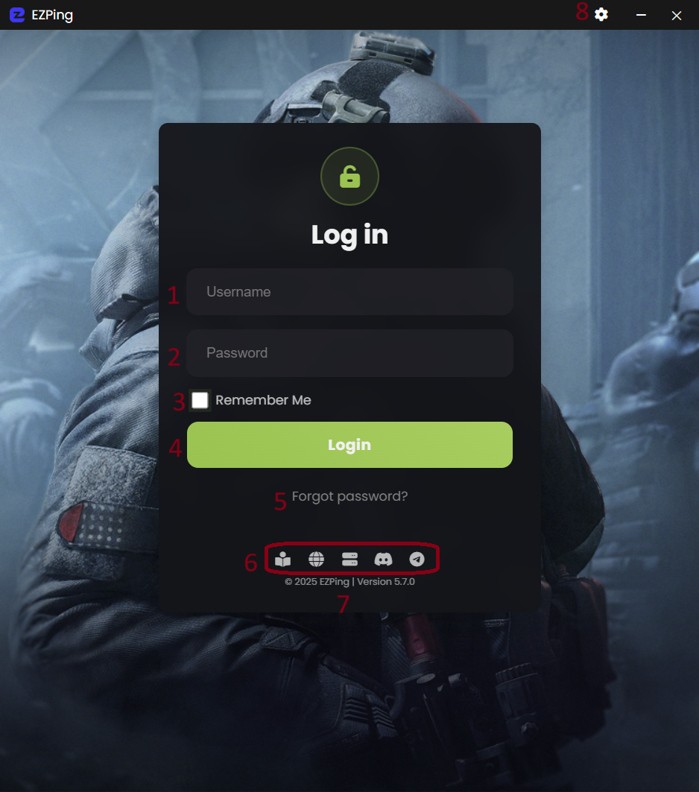
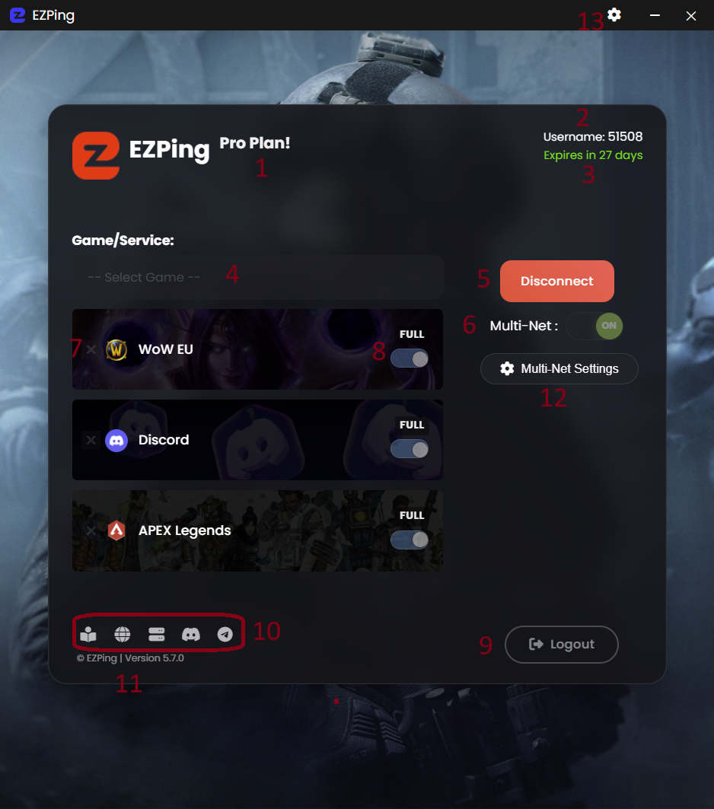

# راهنمای رابط کاربری

  - **رابط کاربری صفحه ی ورود ( Login )**

1. فیلد Username
2. فیلد Password
3. ذخیره نام کاربری و پسورد برای ورود خودکار در اجرا های بعدی
4. دکمه ی ورود به اکانت
5. بازیابی یا تغییر رمز عبور ( برای آموزش [این بخش](https://docs.ezping.ir/how-to-reset-password) را مطالعه کنید )
6. دکمه های دسترسی سریع به راهنمای فنی ، وبسایت **EZPing**  ، وضعیت سرور ها ، چنل دیسکورد ، چنل تلگرام
7. نشانگر ورژن برنامه
8. دکمه ورود به تنظیمات برنامه

  - **رابط کاربری صفحه اصلی برنامه ( Main Menu )**

1. نوع بسته فعال روی اکانت ( برای اطلاعات بیشتر راجع به بسته های مختلف [این بخش](https://docs.ezping.ir/category/%D9%BE%D9%84%D9%86-%D9%87%D8%A7%DB%8C-%D8%A7%DA%A9%D8%A7%D9%86%D8%AA) را مطالعه کنید ) 
2. نام کاربری اکانت
3. تعداد روز های باقی مانده اکانت
4. منوی انتخاب بازی یا سرویس
5. دکمه ی شروع و ایجاد اتصال
6. گزینه ی فعال و غیر فعال کردن حالت **Multi Internet** ( برای اطلاعات بیشتر راجع به حالت Multi-Net [این بخش](https://docs.ezping.ir/how-it-works/multi-net-mode) را مطالعه کنید )
7. گزینه ی حذف بازی یا سرویس از لیست سرویس های فعال
8. گزینه ی انتخاب بین حالت **Full** و حالت **Bypass** برای سرویس مورد نظر ( برای اطلاعات بیشتر راجع به حالت Full و Bypass [این بخش](https://docs.ezping.ir/how-it-works/bypass-vs-full) را مطالعه کنید) 
9. دکمه خروج از اکانت
10. دکمه های دسترسی سریع به راهنمای فنی ، وبسایت **EZPing**  ، وضعیت سرور ها ، چنل دیسکورد ، چنل تلگرام
11. اطلاعات ورژن و بیلد نرم افزار ایزی پینگ
12. دکمه باز کردن وب کنسول تنظیمات Multi-Internet ( برای اطلاعات بیشتر راجع به وب کنسول تنظیمات [این بخش](https://docs.ezping.ir/how-it-works/multi-net-mode#:~:text=%D9%88%D8%A8%20%DA%A9%D9%86%D8%B3%D9%88%D9%84%20%D8%AA%D9%86%D8%B8%DB%8C%D9%85%D8%A7%D8%AA%20Multi%2DNet) را مطالعه کنید )
13. دکمه ورود به تنظیمات برنامه

  - **رابط کاربری صفحه تنظیمات برنامه (Settings)**

1. دکمه خروج از صفحه تنظیمات
2. سوییچ انتخاب پروتکل اتصال
3. سوییچ فعال و غیر فعال کردن حالت Multi-Net برای محتوای غیر In-Game
4. دکمه ست کردن DNS گوگل و همچنین پاک کردن Cache دی ان اس سیستم 

    
