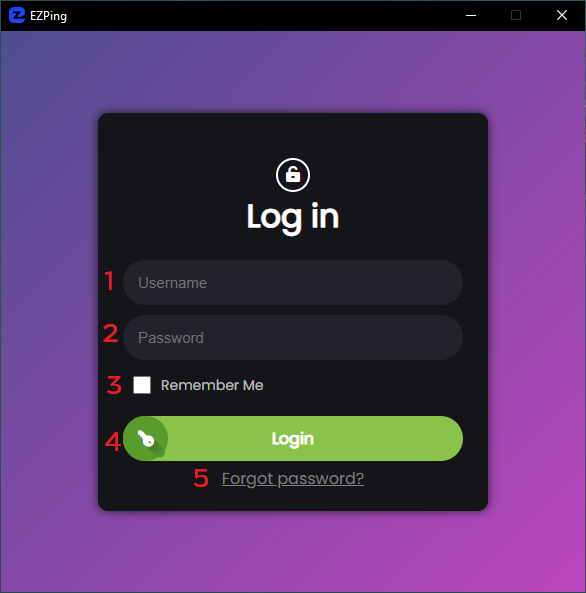
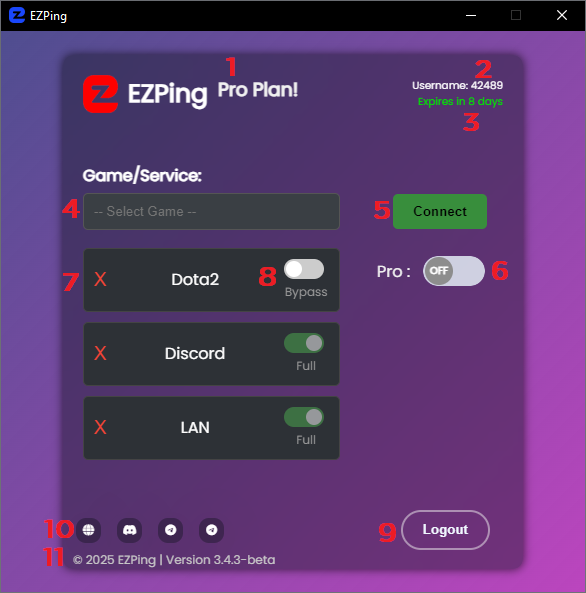

# راهنمای رابط کاربری

  - **رابط کاربری صفحه ی ورود ( Login )**

1. فیلد Username
2. فیلد Password
3. ذخیره نام کاربری و پسورد برای ورود خودکار در اجرا های بعدی
4. دکمه ی ورود به اکانت
5. بازیابی رمز از راه تایید با استفاده از پیامک ارسال شده به شماره موبایل

  
  
  
  - **رابط کاربری صفحه اصلی برنامه ( Main Menu )**

1. نوع بسته فعال روی اکانت ( برای اطلاعات بیشتر راجع به بسته های مختلف [این بخش](https://docs.ezping.ir/category/%D9%BE%D9%84%D9%86-%D9%87%D8%A7%DB%8C-%D8%A7%DA%A9%D8%A7%D9%86%D8%AA) را مطالعه کنید ) 
2. نام کاربری اکانت
3. تعداد روز های باقی مانده اکانت
4. منوی انتخاب بازی یا سرویس
5. دکمه ی شروع و ایجاد اتصال
6. گزینه ی فعال و غیر فعال کردن حالت **Pro** ( برای اطلاعات بیشتر راجع به حالت Pro [این بخش](https://docs.ezping.ir/how-it-works/promode) را مطالعه کنید )
7. گزینه ی حذف بازی یا سرویس از لیست سرویس های فعال
8. گزینه ی انتخاب بین حالت **Full** و حالت **Bypass** برای سرویس مورد نظر ( برای اطلاعات بیشتر راجع به حالت Full و Bypass [این بخش](https://docs.ezping.ir/how-it-works/bypassvsfull) را مطالعه کنید) 
9. دکمه خروج از اکانت
10. منوی تماس با ما و ارتباط با پشتیبانی یا ورود به وبسایت
11. اطلاعات ورژن و بیلد نرم افزار ایزی پینگ
